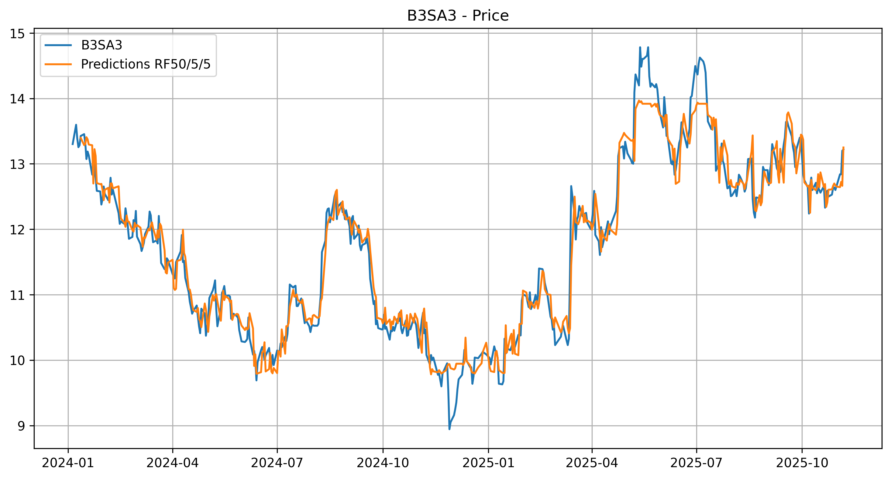
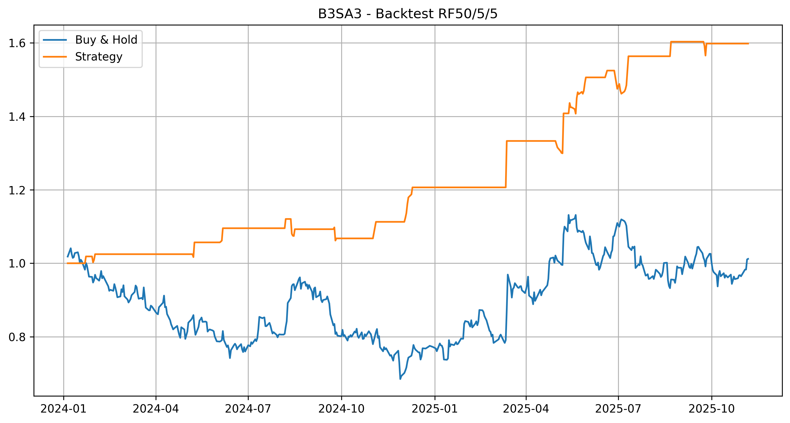
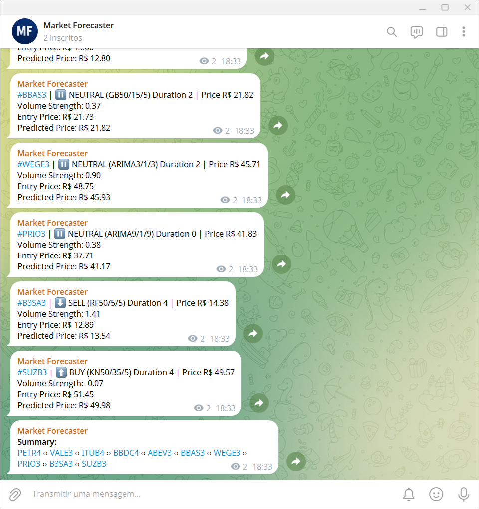

# Market Forecaster

This project provides a Python tool for **backtesting and selecting the best-performing strategies** to spot market time series, applying only **machine learning algorithms**.

As main advantages, the project provides:
- use of **supervised machine learning** to generate trading signals.
- recurring **trading signals via Telegram** channel.
- **open-source code**, allowing **flexibility in specifying** machine learning models and comparing all strategies.

Telegram open channel with daily signals run via GitHub Actions. Anyone can sign up to get a feel for what this bot can offer: [t.me/market_forecasting_public](https://t.me/market_forecasting_public)


## 📊 Features

- **Data download**: Downloads market data through the Yahoo Finance API.
- **Machine-learning-based indicators**: Implements machine-learning-based strategies to identify possible trends.
- **Strategy backtesting**: Runs historical backtests, generating figures and summaries for decision-making.
- **Performance evaluation**: Assesses results using a weighted objective function and ranks the best strategies.
- **Predict future prices**: Make predictions based on supervised machine learning, applying decision tree algorithms. 
- **Telegram notifications**: Sends trading signals from the selected strategy directly to user smartphone or computer. 
- **Configuration files**: Uses `.env` for private environment variables, `.json` for tickers list, `.json`for indicators list, and `.csv` for strategies list.

## 📈 Available Strategies

The project currently supports **supervisioned machine learning** strategies for generating trading signals, using the following methods:
- **Linear Regression**
- **Decision Trees Regressor**
- **Random Forest Regressor**
- **Gradient Boosting Regressor**
- **Extra Trees Regressor**
- **K Neighbors Regressor**
- **Autoregressive Integrated Moving Average (ARIMA)** models


These options allow the user to compare the performance of different approaches within the selected market.

## ⚙️ How to Use

1. **Install dependencies**:
   ```bash
    pip install pandas
    pip install numpy
    pip install yfinance
    pip install requests
    pip install python-dotenv
    pip install scikit-learn
    pip install statsmodels
    ```

2. **Configure tickers and indicators**
   - In `config.json` add the various configuration parameters.
   - In `tickers.json` add the stock codes to analyze.
   - In `indicators.json` add the indicators to generate.
   - In `strategies.csv` list the stocks to generate trading signals, each with its corresponding best strategy.

3. **Configure Telegram**
   - Create a Telegram bot and obtain its `TOKEN`.
   - Create a Telegram channel and obtain its `CHAT_ID`.
   - Add the bot as channel administrator.
   - Add keys to `.env` file to be read by `market_forecaster.py`.

4. **Run the script**
   - To run the batch of backtests, execute:
     ```bash
     python market_forecaster.py
     ```
   - To generate recurrent trading signals and notifications for each ticker, execute:
     ```bash
     python market_forecaster_bot.py
     ```
   - To automate the signal generation with GitHub Actions, create the repository secrets `TOKEN` and `CHAT_ID` for the preconfigured workflow.

## 🖼️ Output Examples

- **Backtest chart with Random Forest**
  
  After running `market_forecaster.py` it generates strategy charts, spreadsheets for each ticker, and a summary with results sorted by best. The generated figures follow the example below:
  
  <p align="center">
    
    
  </p>
  
  Notice that the asset ends the evaluated period near its initial price, so a Buy & Hold strategy would yield approximately a 105% return. On the other hand, strictly following the machine learning strategy with Gradient Boosting would produce above 160% return over the same period, excluding any transactions fees. Furthermore, short selling operations are ignored by default in calculations assuming there exist borrowing fees involved, though they can easily be enabled in the backtest.

- **Trading signals via Telegram**

  After running `market_forecaster_bot.py`, it generates trading signals for the selected (best) strategies, as the example below:
  <p align="center">
    
  </p>

  Notice that a trading signal is generated for each asset, suggesting an up, down or neutral tendency based on the selected strategy and this trend duration, showing how many samples its side remained unchanged. Additionaly, volume data is displayed as strenght indicator for such trends.

  
## 🧩 Project Structure

- `market_forecaster.py` → Main file for backtesting and selecting the best strategies.
- `tickers.json` → List of tickers to analyze.
- `indicators.json` → List of machine-learning-based indicators to test.
- `strategies.csv` → List of selected strategies for trading signals, including tickers and their indicators.


## 📌 Notes

⚠️ We are not responsible for any financial losses resulting from the use of the strategies or signals generated by this code.

- Contributions are welcome! Open an issue or submit a pull request.
- Future improvements and new features may be added, including:
  - more machine learning methods; ✅
  - statistical methods (ARIMA); ✅
  - improve objective function with new weights and presets;
  - use optimizer for the objective function.


## 🤝 Support

This repository is independently maintained, only in free time. If you find the code useful and wish to support its continued development, consider donating:

- [PayPal](https://www.paypal.com/donate/?hosted_button_id=BF6E8J7P32KWE)  

Your support helps keep the project alive and evolving, by adding new indicators, improvements, and documentation.
